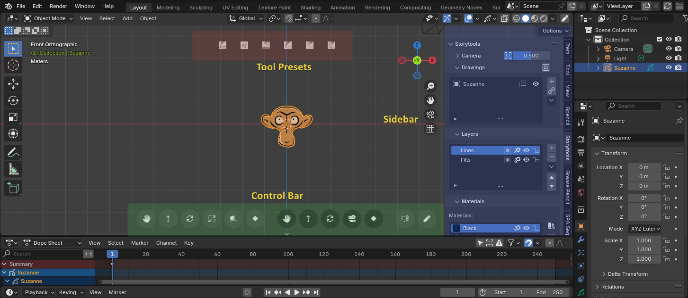

# Storytools Blender Addon Documentation

## What is Storytools?

Storytools is a Blender addon, it aim to ease the use of Blender for 2D animator and particularly for storyboard artist.

### Main features
    
- Simplify objects interaction with more direct controls for 2D oriented artists
- Extend Blender storyboarding capabilities by exposing useful native features and adding new ones.

### Overview of storytools areas

- **Control Bar:** ([Doc page](./tutorial/story-toolbar.md)) Direct objects and camera controls in the viewport.
- **Sidebar Tab:** ([Doc page](./tutorial/sidebar-panels.md)) All in one properties view to manage grease pencils objects, layers, materials + cameras + additional operators.
- **Tool Presets Bar:** ([Doc page](./tutorial/tool-presets.md)) Preset buttons and shortcuts to quickly swap grease pencil tools, brush, layers and more.

## Storyboard quick start

To directly jump into a storyboard setup with step by step guide, covering installation to first shot, go to the [**Setup Project**](tutorial/setup-project.md) section.

<!-- More on the origin of storytools in the [about](about-storytools.md) section -->