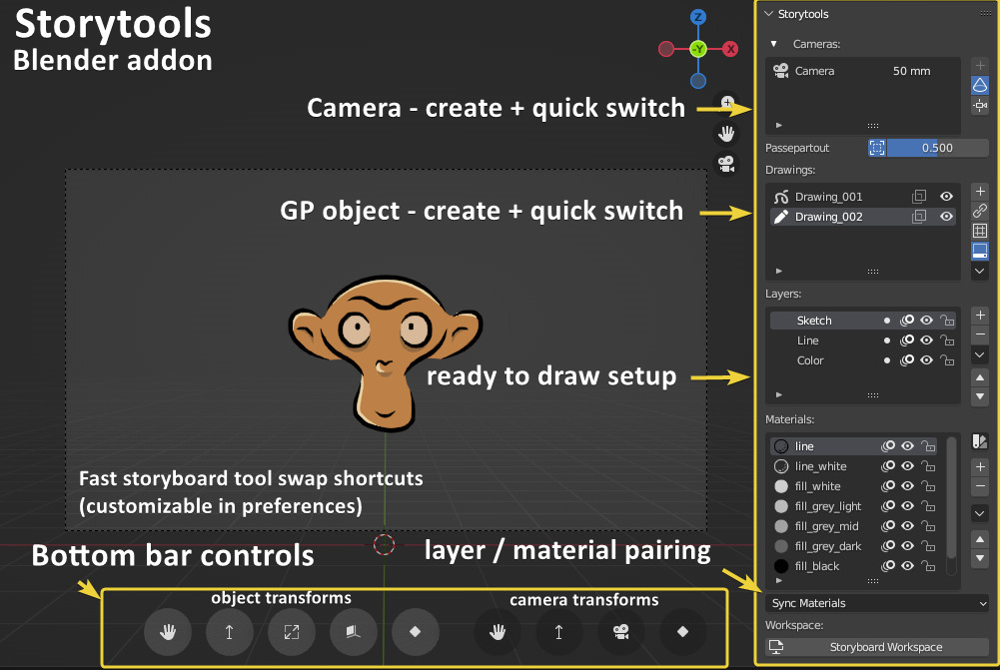

# Storytools Blender Addon Documentation

## What is Storytools?

Storytools is a Blender addon, it aim to ease the use of Blender for 2D animator and particularly for storyboard artist.

Main features:
    
- Simplify objects interaction with more direct controls for 2D oriented artists
- Extend Blender with storyboarding capabilities

More on storytools in the [about](about-storytools.md) section

## Installation

You will need the software [Blender](https://www.blender.org/), with a mininum version of 4.0 and maximum version 4.2 
<!-- (or [SPA build](https://the-spa-studios.github.io/blender-spa-userdoc/) Windows only) -->

Storytools is available on the [official storytools repository](https://github.com/Pullusb/storytools).

> It will be added in blender-extension platform in a near future for direct download in blender

<!-- Storytools can be installed in Blender directly within using the extension platform. -->

Starting blender 4.2, you can simply drag-n-drop downloaded zip file on Blender window for installation

On Blender version _before_ 4.2, see this tutorial on [how to install Blender addons](https://github.com/Pullusb/How_to_install_Blender_addons): 

## Use of SPA sequener

Storytools take only care of objects management and controls in viewport.  
For a full storyboard setup, it need to be used in tandem with another addon to handle the shot management

Though you can use any other means for shot management, it's  **Spa-sequencer** addon, created at SPA studios that will be referenced in this documentation.

As of now (sept. 2024) in blender standard it's preferable to use **SPArk** a more up to date fork  
[Get SPArk here](https://github.com/NickTiny/SPArk-sequencer-addon)
<!-- Here is the link to [original spa-sequencer repository](https://github.com/The-SPA-Studios/sequencer-addon) -->

For more infos about this, head to the [shot management page](tutorial/shot-management.md)

## Storyboard Quick start

To directly jump into storyboard setup with step by step guide, go to the [Setup Project](tutorial/setup-project.md)