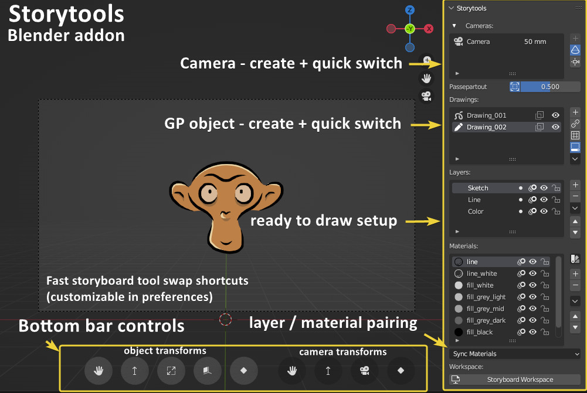
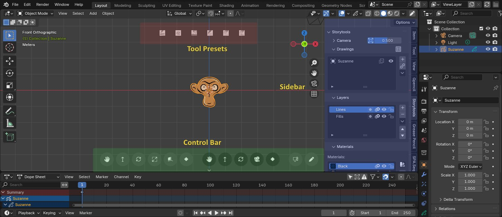

# Storytools Blender Addon Documentation

## What is Storytools?

Storytools is a Blender addon that aims to ease the use of Blender for 2D animators, particularly for storyboard artists.

### Main features
    
- Simplifies object interaction with more direct controls for 2D-oriented artists
- Extends Blender's storyboarding capabilities by exposing useful native features and adding new ones.

### Youtube Demo videos

[**Storytools Full feature overview**](https://www.youtube.com/embed/u4pZSfaB-1k)

[**Storyboard demonstration using Storytools + Spark**](https://www.youtube.com/embed/DH2OaPa2kR4)

<!-- Full feature overview:
<iframe width="560" height="315" src="https://www.youtube.com/embed/u4pZSfaB-1k" title="Feature Overview Video" frameborder="0" allow="accelerometer; autoplay; clipboard-write; encrypted-media; gyroscope; picture-in-picture" allowfullscreen></iframe>

Storyboard demonstration:  
<iframe width="560" height="315" src="https://www.youtube.com/embed/DH2OaPa2kR4" title="Storyboard Demonstration Video" frameborder="0" allow="accelerometer; autoplay; clipboard-write; encrypted-media; gyroscope; picture-in-picture" allowfullscreen></iframe> -->

### Overview of storytools interface

Main areas:

- **Control Bar:** ([Doc page](./tutorial/story-toolbar.md)) Direct objects and camera controls in the viewport.
- **Sidebar Tab:** ([Doc page](./tutorial/sidebar-panels.md)) All in one properties view to manage grease pencils objects, layers, materials + cameras + additional operators.
- **Tool Presets Bar:** ([Doc page](./tutorial/tool-presets.md)) Preset buttons and shortcuts to quickly swap grease pencil tools, brush, layers and more.

**Viewport feature:** ([Doc page](./tutorial/viewport-features.md)) additional features not visible in screenshot above.

## Storyboard quick start

To directly jump into a storyboard setup with step by step guide, covering installation to first shot, go to the [**Setup Project**](tutorial/setup-project.md) section.

<!-- More on the origin of storytools in the [about](about-storytools.md) section -->