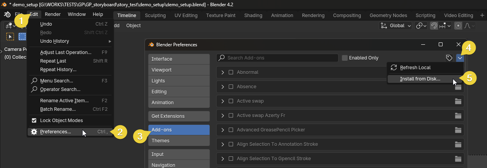
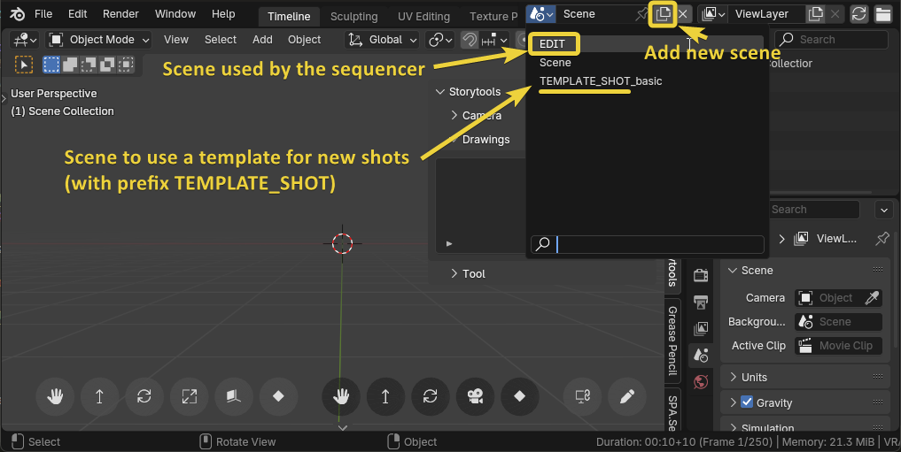
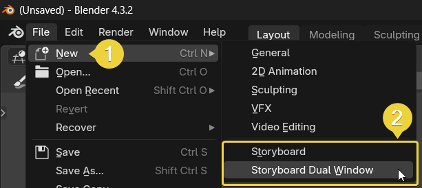
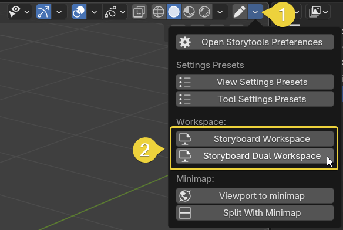
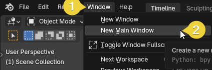
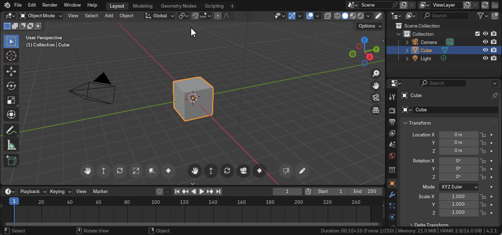
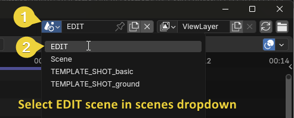
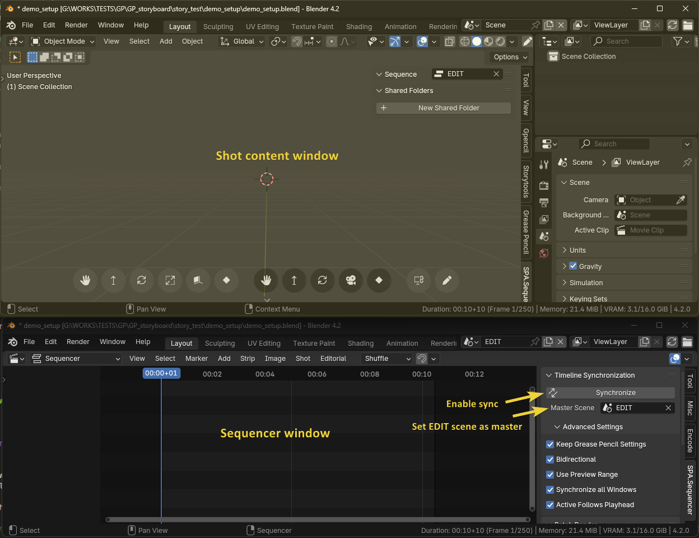
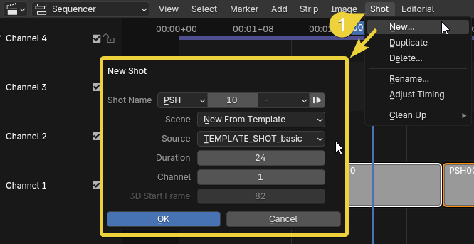
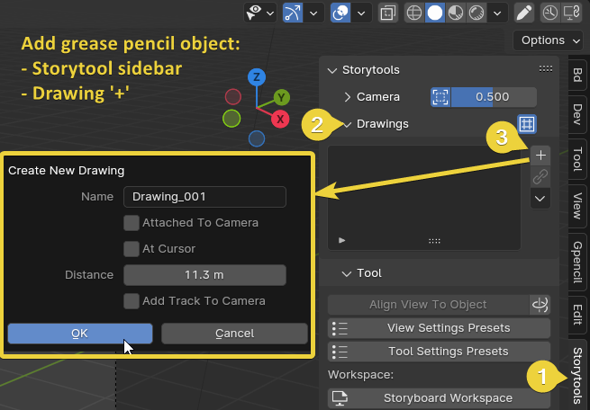

# Setup Project
> How to set up a storyboard session

## Storytools + shot management

Storytools add viewport controls and objects management.

To setup the shots, you need a dedicated tool.
You use any alternative you like (ex: Storypencil)  
This tutorial will explain how to work with the *Spa-sequencer* addon in Blender standard

> **Spa-sequencer** has very complete [documentation](https://the-spa-studios.github.io/blender-spa-userdoc/).  
> The addon is meant to be used with a special SPA build (Windows only, and too old to work with storytools, link in spa-documentation homepage).  
> But it can actually be used with Blender standard, at the cost of having to use dual windows, one for the sequencer, the other for the viewport.
> In the future, it should be possible to use it in standard Blender in single window mode.

## Install

You need Blender software:

Get latest [Blender on the download page](https://www.blender.org/download/).

> If you want to manage multiple versions and easy downloads, check [Blender launcher in the resources section](./resources.md#blender-launcher).

The next step is to download, install, and enable the addons:

- Get latest [storytools on the repository page](https://github.com/Pullusb/storytools) or directly [download the latest](https://github.com/Pullusb/storytools/archive/refs/heads/master.zip) (For Blender 4.2 or below, get the appropriate version from the [release page](https://github.com/Pullusb/storytools/releases)).
- Get latest [SPArk (a more up-to-date fork of spa-sequencer) on the repository's release page](https://github.com/NickTiny/SPArk-sequencer-addon/releases) (click on the latest "spa_sequencer_x_x_x.zip").

> The latest storytools version is incompatible with 4.2 and below.

Since Blender 4.2, you just have to drag and drop the zip file on the opened Blender window to install.

If it does not work, go to `Edit > Preferences > Add-ons` and use `Install from File`.

## How to use Spa-sequencer in Blender standard

Spark setup is partly described in the [storyboard demo video here at 1:22](https://youtu.be/DH2OaPa2kR4?si=g1uc7DqnyMhgymbR&t=81):

### Setup scenes

We will need at least one extra scene for the sequence part.

Create a new scene and name it `EDIT`, then use the scene selector to reset the current window to use `Scene` again (we will use the `EDIT` scene as a dedicated workspace in the next step).

> You can also create new scenes named with the `TEMPLATE_SHOT_` prefix. After setup, new scenes can be created directly in the sequencer using those templates.

### Dual window setup

Storytools is shipped with two template workspaces, including a dual window mode:

Load **workspace in a new file**: `File > New > Storyboard Dual Window`.

Or load **workspace in the current file**: Use the dedicated _storytools setup menu_ in the top-right corner of the 3D viewport.

Then go to step 2 of the manual method below.

> Note that it's possible to use only one window as explained in this [video by Nick Alberelli](https://youtu.be/pQwSo5sGBeY?si=Cr25klWg8ASRRP_J&t=532).
> But you'll have to jump back and forth between the sequencer and drawing view.

#### Manual method

1. To create an additional window, go to the main header menu: `Window > New Main Window`.

> It's important to create a new **Main** window so it can affect a different scene.

This new window will be used for the sequencer.  
Remove all the editors to leave only a `sequencer editor visible`.  
Right-click on the limits between editor areas > click `Join Areas` > click on the side to remove.

Example using the `Video sequencer` workspace template as a base:

2. Arrange the window at the bottom of your screen so it stays visible below the previous one.

> Tips: On _Windows 11_, you can use the shortcut `Win + ↑` to stick the first window at the top, then you can select the other window to go at the bottom, which automatically creates a "window group" in the taskbar.

On the new "sequencer" window, set the scene selector to `EDIT`.

Open the side panel (`N` key with the mouse over the editor), go to the `SPA.sequencer` tab and point to the `EDIT` scene, then activate `Sync`.
Now this window will control the scenes and shots displayed on the other window.

Only when the focus is on the bottom window will you play along all the shots.

Now the setup is done, and you are ready to create shots!

## Add shots

You can add, duplicate, and remove shots in the sequencer `Shots` menu.

At this point, you're basically set.

The YouTube video [Demo of The SPA Studios' Sequence Toolset in Blender](https://www.youtube.com/watch?v=pQwSo5sGBeY) by Nick Alberelli explains how to use the sequencer.

For more details, you also have the written [Spa-sequencer documentation](https://the-spa-studios.github.io/blender-spa-userdoc/layout/#your-first-shot) (except that you'll have to play with two windows instead of one).

## Add drawing with Storytools

Now you are in a shot, and you want to add a new grease pencil object.

> Most editor's sidebars open with the `N` key.

Use `Storytools > Drawings` in the viewport sidebar.

Enter **Draw mode** by using _Tab_ or the dedicated [bottom bar "pen" button](./story-toolbar.md#set-draw-mode) or by selecting one of the left tools in the upper _tool preset_ bar.

Draw things!
