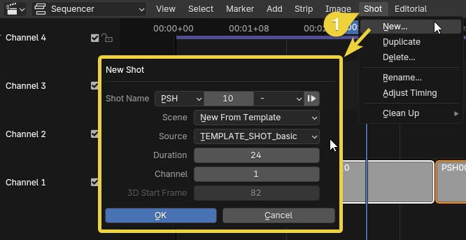

# Set up project
> How to setup a storyboard session

## Storytools + shot management

Storytools add viewport controls and objects management.

To setup the shots, you need a dedicated tool.
You use any alternative you like (ex: Storypencil)  
This tutorial will explain how to work with the *Spa-sequencer* addon in Blender standard

> **Spa-sequencer** has a very complete [documentation](https://the-spa-studios.github.io/blender-spa-userdoc/)  
> The addon is meant to be used with a special SPA build (windows only, and too old to work with storytools, link in spa-documentation homepage).  
> But it can actually be used with Blender standard, at the cost of having to use dual window, one for the sequencer, the other for the viewport.
> In the future, it should be possible to use it in standard blender in single window mode.

## Install addons

The first step if is to download install and enable the addons:

- Get latest [storytools release with this link](https://github.com/Pullusb/storytools/archive/refs/heads/master.zip)
- Get latest [SPArk (a spa-sequencer fork) on this page](https://github.com/NickTiny/SPArk-sequencer-addon/releases)

In Blender 4.2, you just have to drag and drop the zip file on Blender window.

If it does not work, go to `Edit > Preferences > addons` and uses `install from file`

## How to use Spa-sequencer in Blender standard

### Setup scenes

First, it will need at least one extra scene for the sequence part.

Create a new scene and name it `EDIT`

> You can also create new scenes named with `TEMPLATE_SHOT_` prefix. New scene can be created directly in sequencer using this template.

### Dual window setup

> Note that it's possible to use only one window as explained in this [video by Nick Alberelli](https://youtu.be/pQwSo5sGBeY?si=Cr25klWg8ASRRP_J&t=532)
> But you'll have to jump back and forth between sequencer and drawing view.

To create an additional window, go to the main header menu: `Window > New Main Window`

This new window will be used for the sequencer.  
Remove all the editors to let only a `sequencer editor visible`

Arrange the window so it stay visible below the the previous one.

> Tips: On _Windows 11_, you can use the shortcut `Win + ↑` to stick the first windows at the top, then you can select the other window to go at the bottom and create a group window

On the new sequencer scene, open the side panel (`N` key with mouse over editor), go to the `SPA-sequencer` tab and point to the `EDIT` scene, then activate `Sync`.  
Now this window will control the shot displayed on the other window.

Only when the focus is on the bottom window will you play along all the shot

Now the setup is done, and you are ready to create shots !

## Add shots

You can add, duplicate, remove shots in the sequencer `Shots` menu

At this point your basically set.

The youtuve video [Demo of The SPA Studios' Sequence Toolset in Blender](https://www.youtube.com/watch?v=pQwSo5sGBeY) by Nick Alberelli, explain how use the sequencer.

For more details, you also have the written [Spa-sequencer documentation](https://the-spa-studios.github.io/blender-spa-userdoc/layout/#your-first-shot) (except that you'll have to play with two window instead of one)

## Add Drawing with storytools

Now you are in a shot, and you want to add a new grease pencil object.
