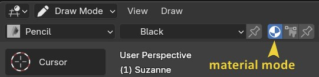
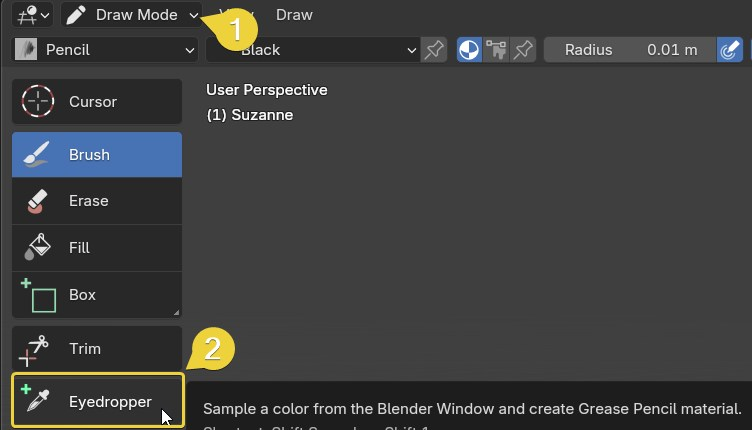
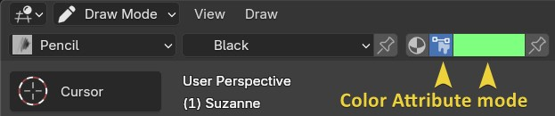
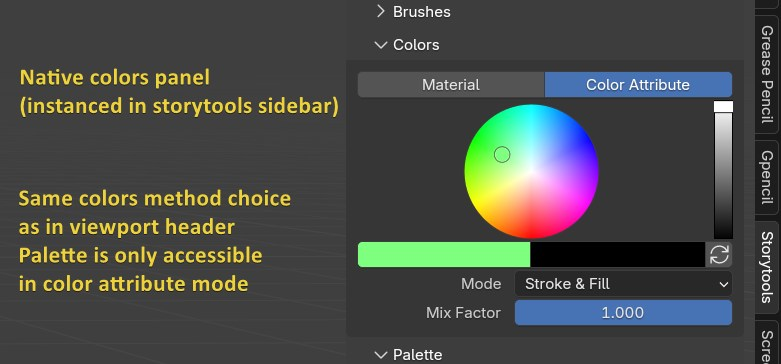

# Sidebar Panels

## Quick access

The sidebar contains all you need to manage your cameras and grease pencil objects.

## Camera management

Passepartout and opacity are exposed in the panel header.

In a storyboard context, there will probably be only one camera per shot.  
But having multiple allows testing alternative movements.  
Clicking on the camera icon or name will make it active.  

### Camera lens

The `lens` display can be disabled in subpanel.  

A bunch of classic lens shortcuts are provided in subpanel.

### Track to constraint on object

In some cases, it's easier to handle the direction of the camera using a target in 3D space.  
The `Add Track-to Constraint` creates an empty object with the camera constrained to look at it.

> If an empty object is already selected, it will be used as target.

The constraint can be managed or removed in the same subpanel.

### GP Toolbox Draw cam switch

If the addon GP toolbox is enabled, a shortcut to the `Draw camera` switch appears in the lateral menu buttons.  
This feature allows rotating in camera view without affecting the camera.  
More on `GP toolbox` and the `Draw cam` in the [resources section](./resources.md#gp-toolbox).

## Grease Pencil Objects

The Grease Pencil objects are listed here.

Clicking on a GP in the list will make it active regardless of the previous mode (except if it is hidden).  
If a GP was selected previously, the mode will be transferred.  

The grid display overlay representing the drawing plane is exposed in the panel header.

### GP lateral menu

`+` button, pops up a menu to add a new GP.

`Chain` button parents/unparents object to active camera (not a dynamic parent!).

The submenu exposes information to display in the list:

- `Show linked data` (Disabled by default): Show when two GPs use the same datablock.
- `Show parents`: Display a chain if the object is parented.
- `In Front toggle`: Expose `In Front` object property, override depth order to show the object in front of others.

## Materials

The same material list as in the properties panel, exposed in sidebar to be able to work without keeping properties panel.

### Layer-material Synchronisation

This feature allow to link the selected material with the active layer.  
When active, returning to this layer later will select the same material.  
This is individual per object but can be unified, useful when multiple objects use the same layer names and materials.

## Native Brushes - Color - Palette

The native Brushes, color, and palette panels are exposed here for convenience when working with custom brushes or using vertex color instead of material.

About colors, there is an important distinction.

Color on a grease pencil object can be stored in two different ways.

1. **Using material** (default method): The color is stored on a material, each different color needs its own material.

In this case, the stroke will take the color of the material selected in the material stack at the moment of the drawing.

> Tips: To easily create a new material from a visible color (i.e: from an empty reference image), you can use the native eyedropper tool.

2. **Using Color attribute** (vertex color): In this case, the colors are defined on the line points at creation.

> Note: Actually, the stroke is still associated with the selected material. But the line points color simply have full opacity over it.

The `colors` panel in the storytools tab is just a bigger version of the header toggle.  

## Tool

Some extra tools that can prove handy.

### Align view

`Align view to Object`: Set free view in front of the object drawing plane.

`Opposite View`: Turn free view by 180° to watch opposite side.

## Tools

An extra _tools_ panel is added if the addon `Grease Pencil Tools` is enabled.
For more info on the addon go to the [resources section](./resources.md#grease-pencil-tools).
