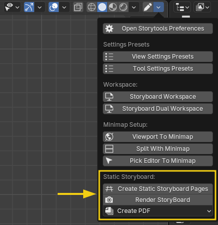
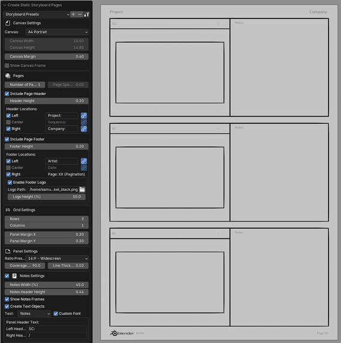
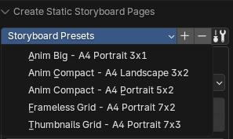
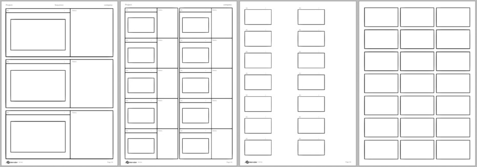

# Storyboard template generator

All related features are located in the setup menu

## Create static storyboard

Generate the pages and grid according to your needs.

First, launch `Create Static Storyboard Pages` operator.  
It's recommanded to do that in an empty scene and disable autokey.

Then use the _Redo panel_ to customize the grid layout.

> Note: The Redo Panel show is visible at viewport's bottom left or pop up by pressing `F9` key.

### Generation workflow:

1. At the top of the `redo panel`, select a preset that is close to what you need

> The first time you use it, you will see a red button to add a set of default presets.

Example of the A4 portrait defaut layout:

2. Fine tune the grid layout with all options to make it fit your need.

> For performance it's recommanded keep the `page number` at 1 during the customization, then set the number of pages at the end.

3. If you are satisfied with the layout, you can save the settings as a new template using the `+` button at the right of the presets

### Add more page on an existing storyboard

If you did not put enough pages and just want more:

1. Select your object and run `Create Static Storyboard Pages` again (settings should be restored as they were to create this specific Grease pencil object)

2. By default, it erase previous elements, in this case where you already have notes and drawing, uncheck `Remove Pre-generated Elements` at the bottom of panel.

3. Add more page in the input

### Rendering

Once you are finished, use the setup menu again and use the `Render Storyboard` button.  
Before launching the render you will see a popup with some settings to prepare for the final rendering, including output path.  

### Making a pdf file

The last button in the setup menu allow to create a pdf from the rendered images to easily share your storyboard with the world.  
You have the option to either use all the images in the rendering folder or popup an explorer window to select the images to include.
Pdf will open after the creation is finished.

> Note: It will ask you to install the required module the first time.  

