# Control bar 

## What's in the bar ?

The bottom control bar contain some useful actions to move around object and camera.

Most of the actions affect only active object/camera.

Those actions work regardless of the mode you're in, meaning you can move active object without leaving draw mode.

Note: Some action are always relative to camera view, see details below

You can collapse the bar or disable it completely in addon preferences

## Object actions

### Move Pan

Move active object perpendicular to view

`Shift` : Precision mode  
`Ctrl` : Lock on X or Y view axis depending on free movements    
`X` (toggle) : lock on X view axis  
`Y` (toggle) : lock on Y view axis  

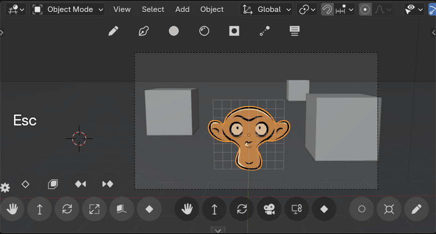

### Move forward / backward

Move the object in depth relative to camera.  
`Shift` : Precision mode
`Ctrl` : Adjust Scale so object retain same size in camera frame  
`Alt` : Constraint on horizontal plane  

> Note: even if you're in free navigation, The move is still relative to active camera

During transform, there is a hint color overlay:

- everything in tinted red is behind object
- everything in tinted blue is in fron of object

The overlay can be customised or disabled in addon preferences

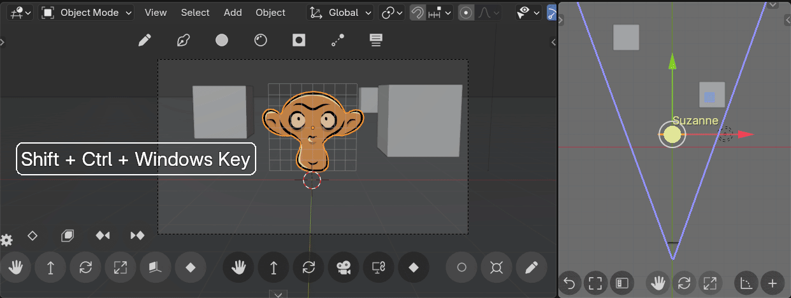

### Rotate

Rotate object on view axis

`Shift` : Precision mode  
`Ctrl` : Snap on 15 degrees angles  

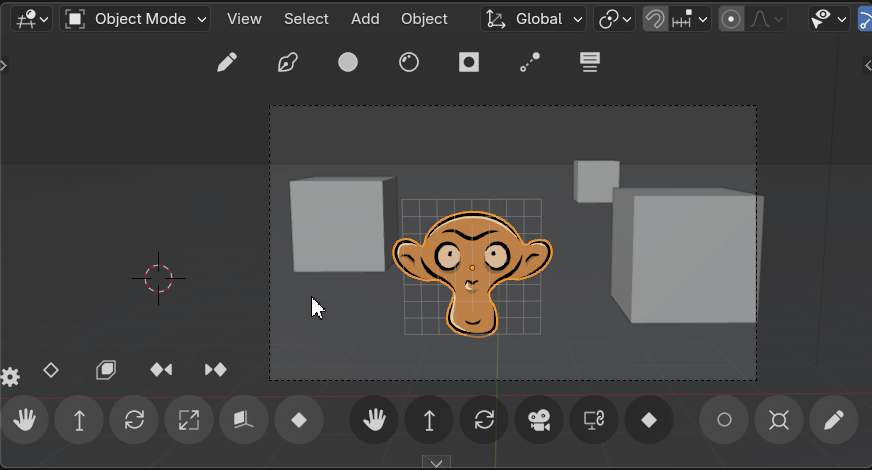

### Scale

Scale object, drag left<->right

`Shift` : Precision mode

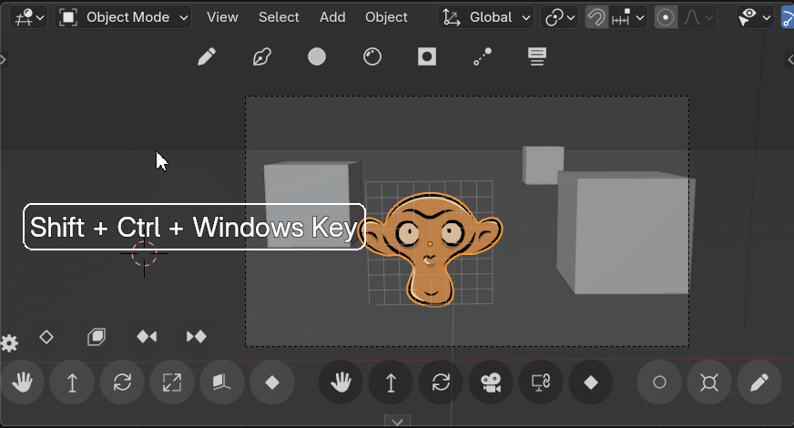

### Align to view

Align object with view

`Shift` : Bring selected objects in front of camera  
`Ctrl` : Set object Z axis pointing up while aligning  

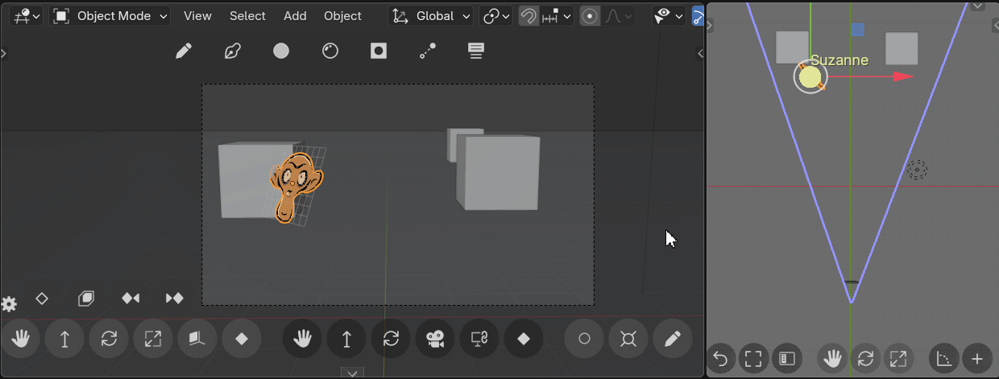

### Key transform

Add key on object location, rotation and scale

> Does not affect grease pencil layers frames

## Camera actions

### Camera Pan / Shift

Move the camera along view axis x-y plane (Pan)  
or affect shift value (Perspective camera only)

`Shift` : Precision mode  
`X` (toggle) : lock on X view axis  
`Y` (toggle) : lock on Y view axis  
`Ctrl` (During) : Lock on X or Y view axis depending on free movements

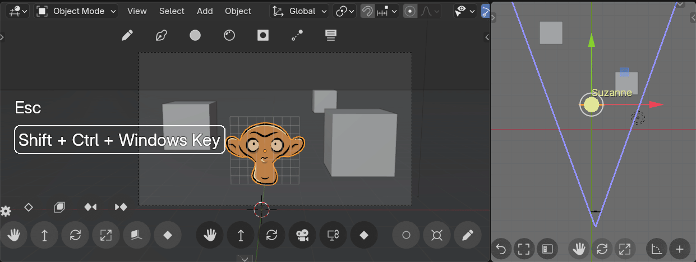

_Shift mode_  
`Ctrl` (Start) : Use Camera shift the camera instead of pan:
  - During shift transform :
    - Same toggles on `Shift, X, Y`
    - `Alt`: Snap on center and every half frame size
    - And overlay is displayed to show centered frame position

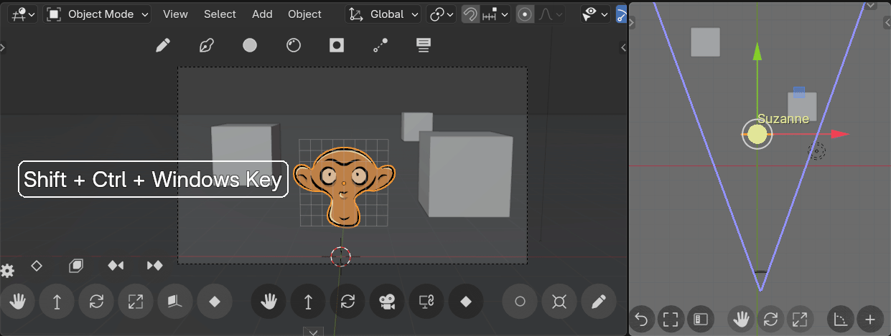

### Camera Depth / Focal Ortho-size

Move camera on depth axis (forward or backward)  
or affect camera "zoom"

`Shift` : Precision mode  

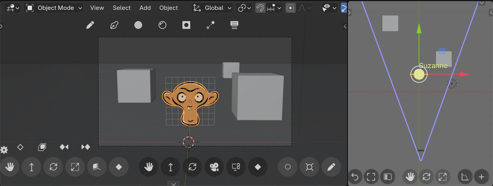

_Focal mode_  
`Ctrl` (Start) : Affect camera focal lenght (perspective camera) or orthographic scale (ortho camera)

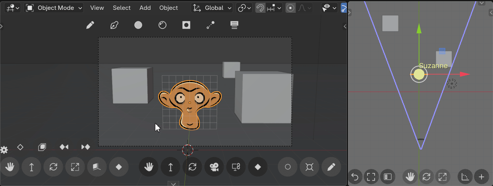

### Rotate

Rotate camera, rotate view in free view

`Shift` : Precision mode  
`Ctrl` : Snap on 15 degrees angles
`Double click` : Reset rotation

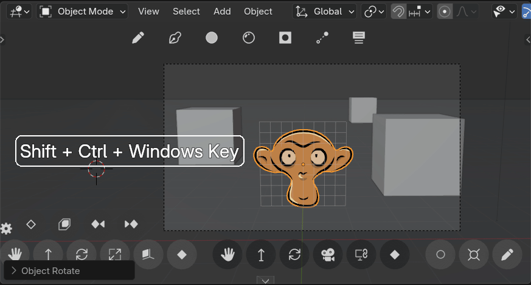

### Camera lock

In Camera view: Toggle "_lock camera to view_" (on active viewport)  
In free view: Go to camera view  

`Shift` : Match view zoom to render resolution  
`Ctrl` : Center and resize view to fit camera bounds  

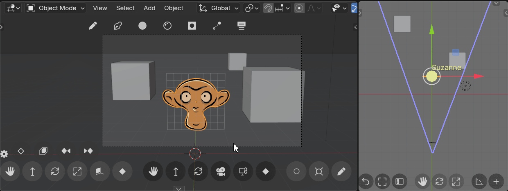

### Key transform

Add key on active camera location and rotation

## Draw actions

### Autokey toggle

Toggle autokey (Set same state in all scenes)

### Snap 3D Cursor

Place 3d Cursor to selected object

`Shift` : Send selection to 3d cursor
`Drag from button`: Place 3D cursor on current GP drawing plane or geometry

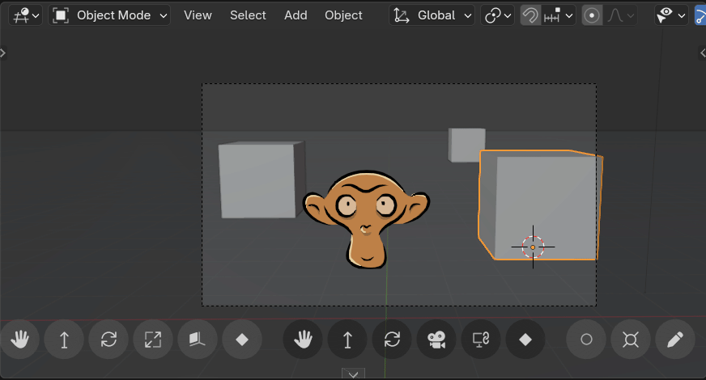

### Lock current view

Lock current viewport orbit navigation.  
when toggled on, the orbit shortcut becomes and additional Pan.  
This way you can't accidentally go out of camera or ensure you stay in the same view axis.

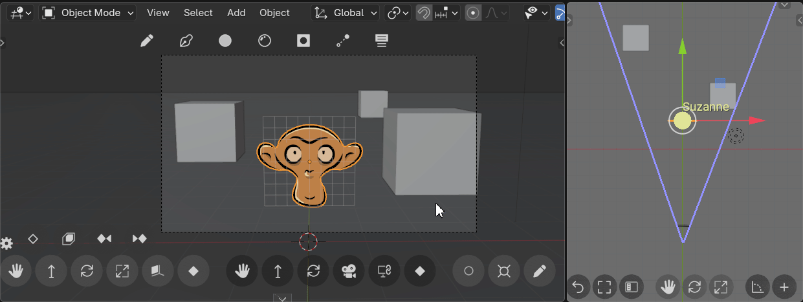

### Set draw mode

If a Grease pencil object is active : Toggle between Draw mode and Object mode.  
If no Grease pencil active. Set the first on visible in scene as active.  

`Shift` : Popup "add GP" (pop without shift when no GP object exists in scene)

> Note that upper tool preset also set draw mode (in default settings)
