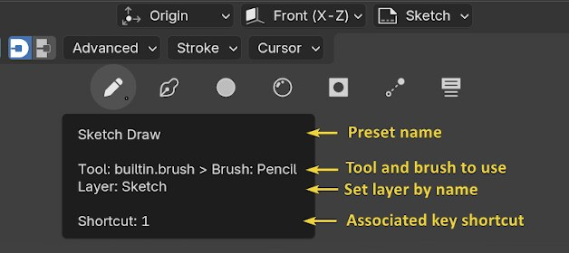
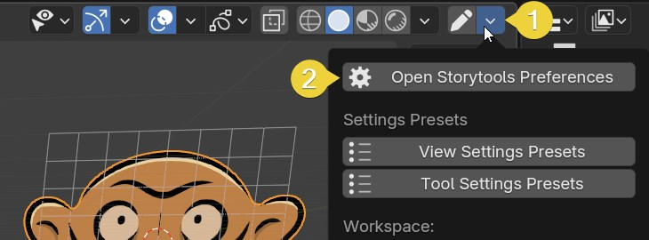
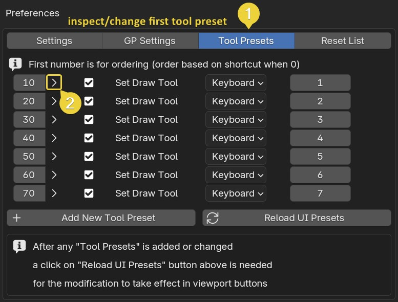
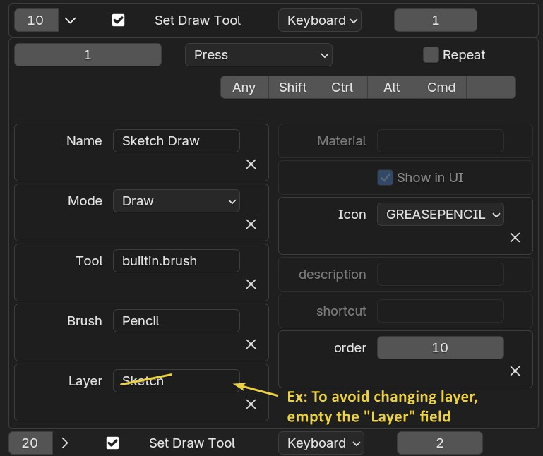
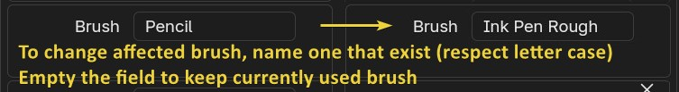
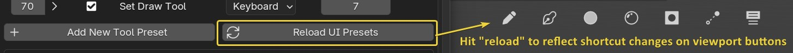

# Tool Presets

## What are tool presets?

In storyboard, you only need a handful of tools, each with a specific use.  
The tool presets are like macros to set Blender tools with specific options in one action.  
Each one is defined through a shortcut and appears as a button in the `Tool preset topbar` in the upper part of the viewport.  

You can hide the topbar in the add-on preferences (the shortcuts will remain valid).  
Topbar margin and spreading can also be adjusted in preferences.

## Anatomy of a tool preset

By hovering with the mouse, you can see what is affected in the tooltip. Example with the `Sketch` default tool preset:

Clicking on it will:
- Set the `Draw` tool (from left Toolbar)
- set the brush named `Pencil`
- Change layer to the one named `Sketch` (if it exists in stack)

## Default tools presets and their shortcut

> Note: The default tools are subject to change in future versions.

Default tools presets are associated with keyboard top row number keys and sorted by key order.

`1` : **Sketch Draw** -> draw tool, brush **Pencil**, layer **Sketch**  
`2` : **Line Draw** -> draw tool, brush **Ink Pen**, layer **Line**  
`3` : **Bucket Fill** -> Bucket Fill tool, _no brush_, layer **Color**  
`4` : **Lasso Fill** -> draw tool, Bucket Fill tool, _no brush_, layer **Color**  
`5` : **Eraser Point** -> Eraser tool, brush **Eraser Point**  
`6` : **Eraser Stroke** -> Eraser tool, brush  **Eraser Stroke** 

 <!-- Set Paint mode, (using mode need an ignore function to avoid overwriting shortcuts of other context...)  -->

## Properties of a tool preset

A tool preset can define :

`name`: Name of the tool preset used as identifier  
<!-- `mode`: Mode to swap to if specified -->
`layer`: Layer name to swap to, if exists  
`material`: Material to swap to, if exists  
`tool`: Identifier of the tool to use  
`brush`: Name of the brush to use within tool  
`icon`: Icon to display  
`show`: Display the preset as button in preset bar interface (if hidden, the shortcut remains)<!-- `order`: The order to display on user interface -->

## Preset customization

In addon preferences of storytools go to the `Tool presets` tab

Tips: To quickly open addon prefererence, use viewport's top-right corner setup menu:

Here you can disable, inspect or modify the default tool presets

Let's inspect the first default shortcut, unfold shortcut options with arrow next to ordering number:

Let's say we don't want to change the active layer when using this toolpreset

Same goes for the Brush name: for example you prefer the "Ink Pen Rough"

The panel list all related shortcuts (using the operator `storytools.set_draw_tool`), those are registered in keymaps under `Grease Pencil` > `Grease Pencil Stroke paint mode`.

You can add other shortcut directly from the preference. Use existing presets as examples to customize the behavior.

Lastly, remember this list is just the shortcuts and UI buttons are generated from those.  
When you change something, you need to click on the `Reload UI` button to make the changes effective in the interface buttons.

