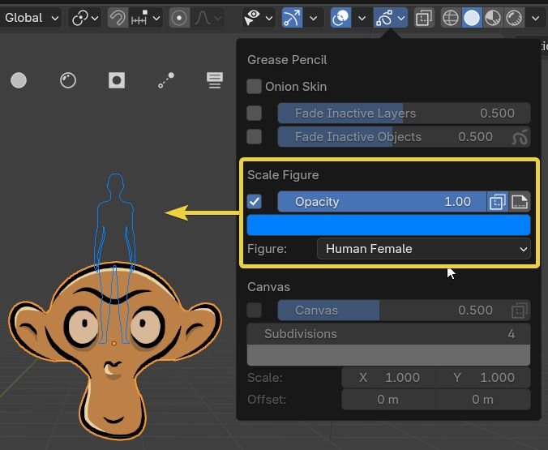
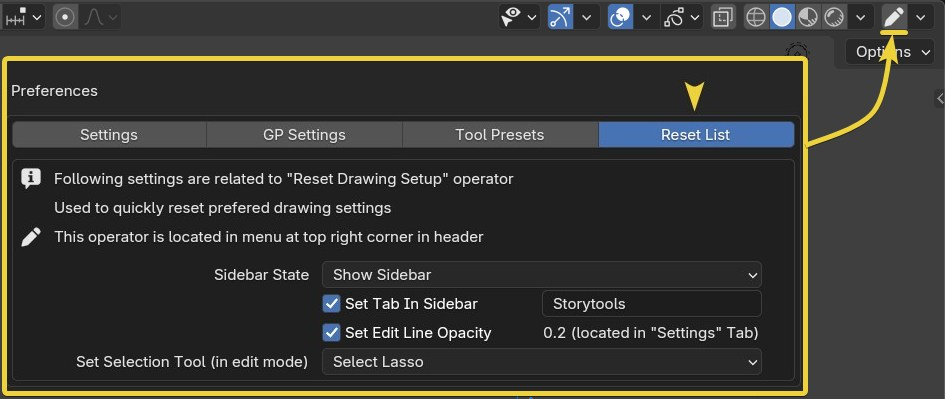
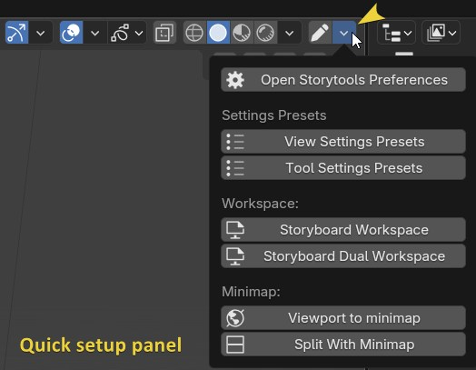
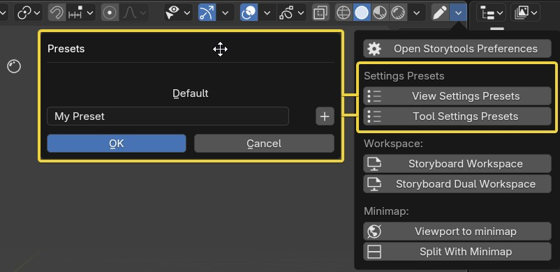
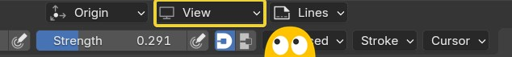

# Viewport features

## Scale figure overlay

To help with real-world scale, Storytools adds a `Scale Figure` option in the GP overlays menu.

You can see that the default monkey has a pretty big head in real-world scale...

The figure will display at the active object's origin, orient according to GPencil settings, and always stay in world scale.

Figure choices:

- Ruler with customizable size (default to 1.8m)
- Human male (1.8m)
- Human female (1.65m)
- Cat (0.3m)

Clicking on the `layer` icon (next to opacity and x-ray toggle) will convert the scale figure into a `ScaleFigure` layer in the grease pencil object. This allows you to place it somewhere else in the scene or include it in the render if you need a size reference.

## Workspace management

### Reset list

> Work in progress

The pen icon at the top right corner is a `quick reset` button.  
It will restore the settings listed in the `Reset list` tab in addon preferences. Customize behavior to your liking.

### Viewport setup panel

Storytools adds a menu to manage viewport options. Located at the top right corner, next to the `quick reset` button.

#### Quick preferences

`Open Storytools Preference`: Quick access to the preferences window, with "Storytools" entered in the search field.

#### View and tool presets

`View Settings Preset`: Store/restore a preset of all the view settings in the *current viewport*.  
This includes: Overlay settings, Shading mode, hide/select toggles at the viewport level...

`Tool Settings Preset`: Store/restore a preset of all the *scene tools options*.  
This includes: GP placement and orientation, autokey state, color mode (Material vs. attributes), snapping mode...

For both of the above, there is a **Default** Preset that resets to factory default.  
This is useful in cases where you have a somewhat messed up viewport or tools; you can try to reset using those (or your own presets).

/!\ Careful: Restoring the _default tool settings_ sets the orientation to `View`. Storytools sets it to `Front Axis` at object creation (if you haven't changed it in addon preferences).

#### Workspace loading

Load one of the two template workspaces shipped with Storytools, single window or dual window.  
This is explained further in the [Setup Project Section](setup-project.md).

#### Minimap setup

Turn the current viewport into a minimap or split the current viewport, creating a minimap on top.

<!-- TODO add a minimap section and link to it or list everything here -->
